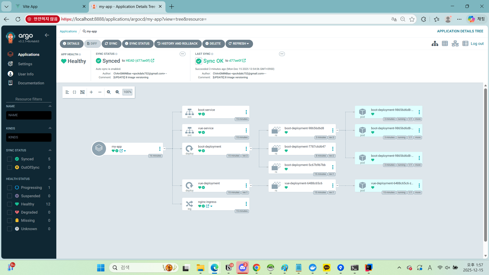

# 🍒 CherryBooker (체리북커)

> **책 속 문장을 체리픽(Cherrypick)하다**  
> OCR 기반 개인 책 서재 & 글귀 아카이브 서비스

---

## 📌 프로젝트 개요

**CherryBooker(체리북커)** 는  
사용자가 책에서 인상 깊은 문장을 *체리픽*하듯 선택해 저장하는  
**개인 독서 기록 및 글귀 아카이빙 서비스**입니다.

책의 구절을 촬영하거나 이미지를 업로드하면  
OCR 기술을 통해 텍스트가 자동으로 추출·저장되며,  
이를 기반으로 개인화된 독서 아카이브를 구축할 수 있습니다.

또한 글귀 스레드 기능을 통해  
다른 사용자들과 문장을 공유하며 독서 경험을 확장합니다.

---

## 👩‍👧‍👦 멤버 소개


<div align="center">

| 김명진 | 김동리 | 김현수 | 박연수 | 배창민 |
|:--:|:--:|:--:|:--:|:--:|
|  |  |  |  |  |

</div>


## 🎯 서비스 목적

- 독서 중 인상 깊은 문장을 쉽고 빠르게 기록
- OCR 기반 자동 텍스트 추출로 문장 기록의 불편함 해소
- 글귀 중심의 개인화된 독서 아카이브 구축
- 글귀 스레드를 통한 독서 커뮤니티 활성화

---

## ✨ 핵심 기능

### 📚 개인 서재 관리
- 읽은 책 / 읽고 싶은 책 분류 관리
- 책 표지 이미지 및 메타 정보(제목, 저자, ISBN) 등록
- 책별 글귀 모아보기 기능

### 📸 OCR 기반 구절 추출
- 카메라 촬영 또는 이미지 업로드
- OCR을 통한 문장 자동 인식
- 원본 이미지 + 텍스트 함께 저장

### 📝 글귀 아카이브 & 메모
- 글귀 등록 / 수정 / 삭제
- 사용자 코멘트(메모) 추가
- 책 및 태그 기반 분류

### 💬 글귀 스레드
- 본인이 추출한 글귀를 스레드에 공유
- 타 사용자는 **본인이 추출한 글귀로만 답변 가능**
- 글귀 중심의 독서 커뮤니티 제공

### 🔔 알림
- 전반적인 알림 기능
- 스레드에 답글 달리면 알림 전송 후, 알림 클릭 시 해당 스레드로 바로 이동
---

<!-- SECTION: 테스트 결과 --> <h1 id="test">🧪 기능 테스트 결과</h1>

아래는 실제 서비스 기능을 검증한 시연 영상입니다.

<details> 
	<summary><b>🔐 로그인 / 인증</b></summary> 
	<h4>로그인/로그아웃(회원)</h4>
	 
	<br>
    <h4>로그인/로그아웃(관리자)</h4>
     
</details>  
<details> 
	<summary><b>📚 개인 서재 관리</b></summary>
	<h4>나의 서재 기능</h4>
	
</details> 

<details> 
	<summary><b> 👤 마이페이지</b></summary> 
     
	<br>
</details> 

<details> 
	<summary><b>📸 OCR 기반 구절 추출 및 글귀 등록</b></summary> 
	<h4>글귀 등록</h4>
	
	<h4>글귀 수정/삭제</h4>
	
</details> 

<details> 
    <summary><b>💬 글귀 스레드</b></summary>
	<h4>스레드 목록 조회</h4>
	
	<h4>스레드 등록</h4>
	
	<h4>스레드 상세 조회</h4>
	
	<h4>스레드 답글 등록</h4>
	
	<h4>스레드 답글 수정</h4>
	
	<h4>스레드 답글 삭제</h4>
	
	<h4>스레드 삭제</h4>
	
</details>

<details> 
	<summary><b>🔔 알림</b></summary> 
	<h4>알림 템플릿 목록 조회</h4>
	
	<h4>알림 템플릿 검색</h4>
	
	<h4>알림 템플릿 상세 조회</h4>
	
	<h4>알림 템플릿 등록</h4>
	
	<h4>알림 템플릿 수정</h4>
	
	<h4>알림 템플릿 삭제</h4>
	
	<h4>알림 로그 검색</h4>
	
	<h4>알림 발송</h4>
	
	<h4>알림함</h4>
	
	<h4>스레드 답글 알림</h4>
	
</details>

<details> 
	<summary><b>🚨 신고</b></summary> 
	<h4>신고 목록 조회</h4>
	
	<h4>신고 처리</h4>
	
	<h4>게시물 신고 접수</h4>
	

</details>

---

## 🛠 기술 스택

### Frontend


### Backend


### Database


### OCR


### Infra & DevOps


---

## 🚀 프로젝트 목표

- 사용자 중심 UX의 독서 기록 서비스 구축  
- OCR 기반 자동 문장 추출 기능 구현  
- 문장 아카이브 확장 (태그, 감정, 추천)  
- CI/CD + Kubernetes 기반의 안정적인 서비스 운영  
- 실서비스 수준의 DevOps 파이프라인 구축 경험  

---

## 🌱 기대 효과

- 개인 독서 경험을 체계적으로 축적하는 맞춤형 독서 플랫폼
- 글귀 스레드를 통한 새로운 형태의 독서 커뮤니티
- OCR 기반 자동화로 편리한 문장 수집 경험 제공
- 배포·확장·모니터링까지 포함한 실무형 프로젝트 완성

---

## 🗂️ 프로젝트 산출물

- ### 📚 요구사항 명세서**
  요구사항 명세서를 자세히 보려면 [여기](https://docs.google.com/spreadsheets/d/1QR_PiTqoFvpmC2nNCuG4F1nPMkxDIkgN3bHzirLP0Fc/edit?gid=0#gid=0)를 클릭하세요.

- ### 🗺️ ERD

  ERD를 자세히 보려면 [여기](https://www.figma.com/design/nQwpBL8EiSqc1z86ha7lxl/CheeryBooker?node-id=0-1&p=f&t=GDbVhfKM7e2URF7i-0)를 클릭하세요

- ### 🎨 피그마

  피그마를 자세히 보려면 [여기](https://www.erdcloud.com/d/DzjLGrZmHWiuiGr8j)를 클릭하세요

---

## 🛜 프로젝트 아키텍처
- k8s 폴더에서 kubernetes manifest yaml 파일 확인 가능


## 🐋 Docker 및 Kubernetes 시연
비디오 링크: https://drive.google.com/drive/folders/1LigHXzHGTJ4yeyiKumNCRqDwJnsBBGNy?usp=sharing

- 프로젝트에서는 Docker 및 Kubernetes 환경에서 애플리케이션이 정상적으로 배포·동작하는 과정을 단계별로 시연
### 🔧 시연 흐름

1. Dockerfile 기반 이미지 빌드
   - Backend 애플리케이션을 Dockerfile로 이미지 빌드
2. Kubernetes Pod 실행 확인
   - 빌드된 이미지를 기반으로 Pod 생성
   - ```kubectl get pods```를 통해 정상 실행 상태 확인
3. Nginx Gateway 구성
   - Nginx를 Gateway로 사용하여 외부 요청을 Backend로 라우팅
   - Kubernetes Service를 통해 Pod와 연결
4. 포트 포워딩 설정
   - Nginx Gateway 및 Backend Service에 대해 ```kubectl port-forward``` 적용
5. 로컬 환경 접속 및 동작 검증
   - 로컬 브라우저/클라이언트에서 접속하여 API 정상 동작 확인

### ✅ 검증 결과
- Docker 이미지 기반으로 Pod가 정상 실행됨을 확인
- Nginx Gateway를 통해 Backend API로 요청이 정상 전달됨
- 로컬 환경에서 포트 포워딩을 통해 서비스 동작을 직접 검증

## 🔁 Kubernetes Service 로드밸런싱 검증 (Round-Robin)

- Kubernetes Service가 다중 Pod 환경에서 요청을 Round-Robin 방식으로 분산 처리하는지 확인하기 위해 간단한 부하 테스트를 진행

### 🧪 테스트 환경
- Backend Pod Replica: 2개
- Kubernetes Service: ClusterIP
- 테스트 도구: hey
- 대상 Endpoint: ```/actuator/health```

### 🚀 부하 테스트 명령어
```
hey -z 100s -c 50 http://localhost:8080/actuator/health
```
- -z 100s : 100초 동안 요청 지속
- -c 50 : 동시 요청 50개

### 🔍 검증 방법
- 부하 테스트 실행 중 kubectl logs를 통해 각 요청을 처리한 Pod replica ID를 확인
```
kubectl logs -l app=cherry-booker --follow
```

### ✅ 테스트 결과
- 동일한 Backend API Endpoint에 대한 요청이
- 두 개의 Pod로 거의 균등하게 분산
- 요청 로그 상에서 Pod replica ID가 번갈아 출력됨을 확인
- 이를 통해 Kubernetes Service가 다중 Pod 환경에서 Round-Robin 기반 로드밸런싱을 정상적으로 수행함을 검증

## 🚀 CI/CD 파이프라인 구성


프로젝트는 **Jenkins + Argo CD** 기반의 CI/CD 파이프라인을 사용

- **CI (Jenkins)**  
  소스 코드 빌드, 테스트, Docker 이미지 빌드 및 Docker Hub 푸시


- **CD (Argo CD)**  
  GitOps 방식으로 Kubernetes 배포 자동화

---

### 1️⃣ Jenkins 연결 테스트 파이프라인

Jenkins, Gradle, Docker, Git 환경이 정상적으로 연결되었는지 확인하기 위한 기본 CI 테스트용 파이프라인

<details> <summary><strong>Jenkins Pipeline – Connection Test</strong></summary>

pipeline {
    agent any

    options {
        timestamps()
        skipDefaultCheckout(true)
        disableConcurrentBuilds()
        buildDiscarder(logRotator(numToKeepStr: '20'))
    }

    tools {
        gradle 'gradle'
        jdk 'openJDK21'
    }

    environment {
        GITHUB_URL  = 'https://github.com/ChAnGMiNBae/CherryBooker-BE-DevOps.git'
        GRADLE_ARGS = '--no-daemon --stacktrace'
    }

    stages {

        stage('Preparation') {
            steps {
                script {
                    if (isUnix()) {
                        sh 'java -version'
                        sh 'gradle -v || true'
                        sh 'docker --version'
                        sh 'git --version'
                    } else {
                        bat 'java -version'
                        bat 'gradle -v'
                        bat 'docker --version'
                        bat 'git --version'
                    }
                }
            }
        }

        stage('Checkout') {
            steps {
                git branch: 'main', url: env.GITHUB_URL
            }
        }

        stage('Build Test') {
            steps {
                script {
                    if (isUnix()) {
                        sh 'chmod +x ./gradlew'
                        sh "./gradlew clean build -x test ${env.GRADLE_ARGS}"
                    } else {
                        bat "gradlew.bat clean build -x test %GRADLE_ARGS%"
                    }
                }
            }
        }
    }

    post {
        success {
            echo 'Jenkins connection test pipeline succeeded.'
        }
        failure {
            echo 'Jenkins connection test pipeline failed.'
        }
    }
}
</details>

### 2️⃣ CI 파이프라인 (Jenkins → Argo CD 연계)

Jenkins에서 실제 CI를 수행하며
빌드 결과 Docker 이미지를 Docker Hub에 푸시
Argo CD는 이미지 태그 변경을 감지하여 Kubernetes 배포를 자동 수행

<details> <summary><strong>Jenkins CI Pipeline – Docker Build & Push</strong></summary>
pipeline {
    agent any

    options {
        timestamps()
        skipDefaultCheckout(true)
        disableConcurrentBuilds()
        buildDiscarder(logRotator(numToKeepStr: '20'))
    }

    tools {
        gradle 'gradle'
        jdk 'openJDK21'
    }

    parameters {
        booleanParam(name: 'SKIP_TESTS', defaultValue: true)
        booleanParam(name: 'ALLOW_TEST_FAILURE', defaultValue: true)
        string(name: 'GIT_BRANCH', defaultValue: 'main')
        string(name: 'IMAGE_NAME', defaultValue: 'test-pipe')
    }

    environment {
        DOCKERHUB = credentials('DOCKERHUB_PASSWORD')
        GITHUB_URL  = 'https://github.com/ChAnGMiNBae/CherryBooker-BE-DevOps.git'
        GRADLE_ARGS = '--no-daemon --stacktrace'
    }

    stages {

        stage('Checkout') {
            steps {
                git branch: params.GIT_BRANCH, url: env.GITHUB_URL

                script {
                    env.GIT_SHORT = sh(
                        script: 'git rev-parse --short HEAD',
                        returnStdout: true
                    ).trim()

                    env.IMAGE = "${env.DOCKERHUB_USR}/${params.IMAGE_NAME}:${env.BUILD_NUMBER}-${env.GIT_SHORT}"
                }
            }
        }

        stage('Build & Docker Push') {
            steps {
                sh "./gradlew clean build -x test ${env.GRADLE_ARGS}"
                sh "docker build -t ${env.IMAGE} ."
                sh 'echo "$DOCKERHUB_PSW" | docker login -u "$DOCKERHUB_USR" --password-stdin'
                sh "docker push ${env.IMAGE}"
            }
        }
    }

    post {
        success {
            echo "CI pipeline succeeded: ${env.IMAGE}"
        }
        unstable {
            echo "CI pipeline unstable (tests failed): ${env.IMAGE}"
        }
        failure {
            echo "CI pipeline failed"
        }
    }
}
</details>


## 🍪 개인 회고록

| 팀원 이름 | 회고 내용 |
|----------|-----------|
| 김동리 | 프로젝트를 진행하면서 영속성 계층을 처음 설계한 형태 그대로 유지하기 어려운 상황을 겪었다. 일부 도메인의 Repository가 다른 팀원의 작업 범위에 있었고, 일정상 해당 구현을 기다리기보다는 기능 개발을 먼저 진행해야 했다. 이로 인해 Repository를 바로 활용하지 못하고, EntityManager와 DB 조회 중심의 방식으로 구현을 진행하게 되었다.엔티티 존재 여부나 단순 검증은 JdbcTemplate을 사용한 직접 SQL 조회로 처리했고, 연관 관계가 필요한 부분은 EntityManager의 getReference()를 사용해 식별자 기반 참조로 대체했다. 결과적으로 일정과 협업 상황을 고려한 현실적인 선택으로 JPA를 중심으로 하되, 일부 구간은 JDBC와 Native Query로 보완한 혼합형 구조가 되었었다. 이는 영속성 접근 방식이 여러 방식이 혼재되면서 코드 일관성과 상태 관리 측면에서 한계가 드러났다. 이번 경험을 통해 영속성 계층 설계는 단순히 기능 구현을 넘어, 팀 협업과 일정까지 함께 고려해야 한다는 점을 느꼈다. 이후에는 Repository 의존 관계를 사전에 명확히 하고, 가능한 한 JPA 중심의 일관된 구조를 유지하되, 불가피한 경우에도 우회 방식의 범위와 책임을 명확히 하는 방향으로 개선하고자 한다 |
| 김명진 | 이번 프로젝트를 DevOps 프로젝트에서 인증,권한 부분을 담당했다. 관심은 있었지만 어려울거라 생각이 되어 다른 프로젝트에서 안하다가 이번에 맡았는데 생각보다 더 어려웠다. 프로젝트를 시작할 때 인증, 권한 담당한 사람이 먼저 구축을 해놔야 다른 팀원들이 편하게 작업할 수 있는걸 느꼈고, JWT 기반 인증 이후 토큰 만료나 로그아웃 상황에서 principal이 null로 떨어지는 문제가 있었다. 인증 실패 상황을 고려하지 않은 설계가 원인이었다. 보안 컨텍스트 정리와 인증 객체 검증 로직을 보완하며, 인증은 성공뿐 아니라 실패와 만료까지 포함해 설계해야 한다는 점을 배웠다. 또한 Kakao OAuth2 연동 과정에서는 코드 문제가 아니라 설정 불일치로 오류가 발생해, 외부 인증에서는 환경 설정과 로그 관리의 중요성을 체감했다. 아쉬운점은 DevOps 프로젝트인데 DevOps에 집중을 못한 점 아쉬웠다. 이로 인해 팀원들에게 폐를 끼쳤던 것 같아서 앞으로의 프로젝트에서는 이런일이 없도록 다짐했다. |
| 김현수 | 회고하며 크게 세 가지 아쉬움이 남는다.<br><br>첫째, 시간적 제약으로 인해 Ingress Load Balancer를 더 상세하게 공부하고 적용하지 못한 것이 아쉬웠다.<br><br>둘째, 학부 시절 수강한 데이터 네트워크 과목이 전부였던 탓에 컴퓨터 네트워크 전반에 대한 이해가 부족하다는 한계가 점점 더 분명해지고 있다. 실제 시스템을 설계하고 운영하는 과정에서 네트워크 지식의 부재가 장애 요인으로 작용했으며, 이를 계기로 컴퓨터 네트워크에 대한 체계적인 학습이 필요하다는 것을 느꼈다.<br><br>셋째, MSA 구축 과정에서 충분한 기여를 하지 못했다는 아쉬움이 있다. 이는 도메인 주도 개발 과정에서 DDD를 사실상 건너뛴 영향이 컸다고 생각한다. DDD를 통해 각 도메인을 명확히 정의하고, 팀원별 역할과 책임을 명확히 분리했으면 MSA 구축 뿐만 아니라 개발 속도에도 좋은 영향을 주었을 것 같다. |
| 박연수 | 이번 DevOps 프로젝트를 통해 단순히 “배포를 해본 경험”을 넘어서 서비스 운영 관점에서 개발을 바라보는 시야를 넓힐 수 있었다고 느꼈다.<br><br>이번 프로젝트를 계기로 DevOps는 단순한 도구의 조합이 아니라 개발–배포–운영 전반을 하나의 흐름으로 설계하는 사고 방식이라는 점을 명확히 인식하게 되었다.<br><br>앞으로는 컴퓨터 네트워크와 Kubernetes 내부 동작에 대한 학습을 병행하며, 더 안정적이고 예측 가능한 시스템을 설계할 수 있는 개발자로 성장하고자 한다. |
| 배창민 | 이번 DevOps 프로젝트에서 커뮤니티 기능, 알림 기능, Jenkins 기반 CI/CD 구성을 담당했다. <br><br> 기능 개발과 배포 자동화를 함께 진행하며 개발–빌드–배포 흐름을 직접 경험한 점은 의미가 컸다. <br><br> 다만 기간이 짧아 계속 시간에 쫓기며 진행했고, DevOps에 집중하고 싶었지만 커뮤니티/알림 구현과 이슈 대응에 시간이 많이 소요되어 아쉬움이 남았다. <br><br> 특히 이전 프로젝트에서도 알림을 맡았던 만큼 빠르게 끝낼 수 있을 거라 생각했지만, 예상보다 리팩토링할 부분이 많아 시간이 오래 걸렸다. <br><br> Jenkins 파이프라인을 구성하며 기본 흐름은 만들었지만, 운영 관점에서 더 깊게 이해하고 싶다는 필요를 느꼈고 Argo(GitOps)도 보완 학습이 필요하다고 판단했다. <br><br> 이번 경험으로 DevOps를 어느 정도 맛본 만큼, 이를 발판으로 Jenkins와 Argo 역량을 강화해 다음 프로젝트에서는 배포 자동화와 운영 개선을 더 주도적으로 해보고자 한다. |

